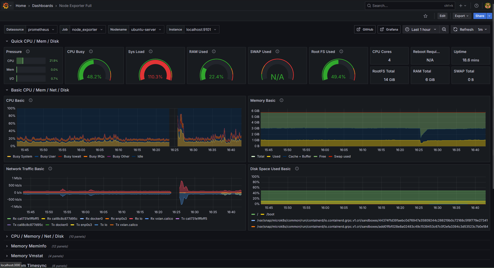

# Prometheus & Grafana | Real-Time Infrastructure Monitoring

A production-ready, open-source stack for monitoring system metrics, application performance, and alerting.

This project provides a manual setup guide for deploying:
- **Prometheus** (metrics collection)  
- **Node Exporter** (Linux/BSD Infrastructure Metrics Collection)
- **Grafana** (visualization Dashboard + alertrules + notification) 

## Key Features
```
✅ Comprehensive Monitoring: Track CPU, memory, disk, network, and service health
✅ Alerting: Configure thresholds with Prometheus Alertmanager or Grafana alerts
✅ Pre-built Dashboards: Import industry-standard dashboards (e.g., Node Exporter Full)
✅ Bare-Metal/KVM Ready: Designed for physical servers and VMs (non-containerized)
```

## Use Cases
- Infrastructure Health: Monitor servers, databases, and APIs
- Capacity Planning: Identify resource bottlenecks
- Incident Response: Get alerted on anomalies (high CPU, disk full, etc.)

## Introduction

Prometheus is a system monitoring application that polls client systems for key metrics. Each client node must use an exporter to collect and expose the requested data. Prometheus is most effective when used together with the Grafana visualization tool. Grafana imports the metrics from Prometheus and presents them using an intuitive dashboard structure.

To integrate the components, download and install Prometheus on a central server and configure Prometheus as a service. Install the Prometheus Node Exporter on each client to collect the data and configure Prometheus to poll the clients. Install Grafana on the same server as Prometheus and configure Prometheus as a data source. Finally, import a dashboard to display the metrics from the client.

---

## Performance monitoring Apps
- **Prometheus** (metrics collection)  
- **Node Exporter** (Linux/BSD Infrastructure Metrics Collection)
- **Grafana** (visualization Dashboard + alertrules + notification) 
---

## 📂 Repository Structure
``` bash
prometheus-grafana-manual/  
├── prometheus/  
│   ├── prometheus.yml          # Main Prometheus config  
│   ├── prometheus.service      # Systemd prometheus service file
│   ├── node_exporter.service   # Systemd node exporter service file  
│   └── with_comments_...       # same config files with comments
├── grafana/
│   ├── dashboards.json      # Exported JSON dashboards  
│   └── alert-rules.yml      # Exported YML alert rules  
├── src/                     # source images
└── README.md                # installation guide
```


## 🔧 Installation and Configuration Steps

*Refer to the **[Installation Guide](prometheus-grafana-manual/README.md)** for step by step instructions.*

1. Install and Configure Prometheus
2. Install and Configure Node Exporter
3. Configure Prometheus to Monitor Node
4. Install and Configure Grafana
5. Integrate Grafana and Prometheus
6. Setting up alerts

## Example Preview

