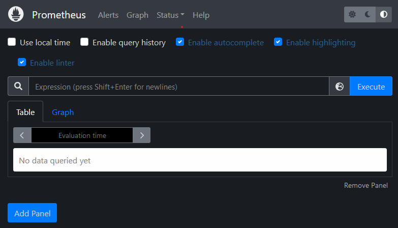
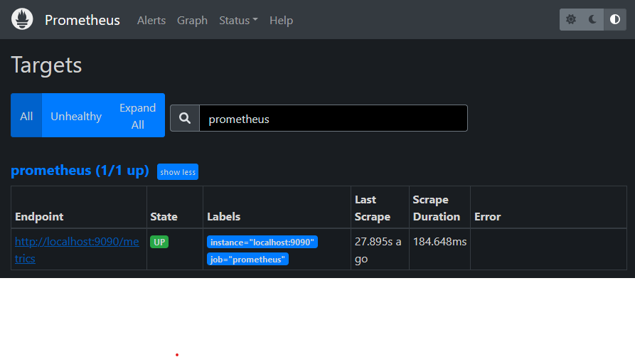
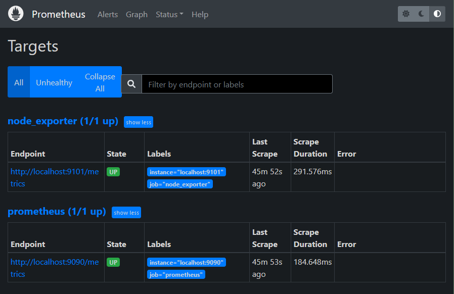

# 1. Install and Configure Prometheus
These instructions were tested on **Ubuntu Server 24.04 LTS**. For other operating systems, consult the relevant documentation.

---
### Step 1: Check for latest version on website
Visit the Prometheus downloads on their [website](https://prometheus.io/download/) and make a note of the most recent release.

I am using the latest LTS at time of this edit is `prometheus-2.53.4.linux-amd64.tar.gz`.

---
### Step 2: Download Prometheus
Use `wget` to download Prometheus to the monitoring server.

*Use `sudo` for commands requiring elevated privileges on systems with security restrictions (e.g., Ubuntu, RHEL, or enterprise environments).*
```bash
# edit the following according to your selected version
$ wget https://github.com/prometheus/prometheus/releases/download/v2.53.4/prometheus-2.53.4.linux-amd64.tar.gz
```
---
### Step 3: Extract the archived files to path and verify installation
- Extract the archived Prometheus files.
- (Optional) delete the archive to free space
```bash
$ tar xvfz prometheus-*.tar.gz
$ rm prometheus-*.tar.gz    # Optional
```
- The `/etc/prometheus` directory stores the Prometheus configuration files. 
- The `/var/lib/prometheus` directory holds application data.
```bash
$ sudo mkdir /etc/prometheus /var/lib/prometheus
```
- Move into the main directory
- Move the prometheus and promtool directories to the `/usr/local/bin/` directory. *This makes Prometheus accessible to all users.*
- Move the configuration file `prometheus.yml` to the `/etc/prometheus` directory.
```bash
$ cd prometheus-2.53.4.linux-amd64
$ sudo mv prometheus promtool /usr/local/bin/
$ sudo mv prometheus.yml /etc/prometheus/prometheus.yml
```
- Use Default or simple configuration of `prometheus.yml` as follows
```yml
global:
  scrape_interval: 15s

scrape_configs:
  - job_name: 'prometheus'
    static_configs:
      - targets: ['localhost:9090']  # Monitor Prometheus itself
```

- The files under directories `consoles` and `console_libraries` should be moved to the `etc/prometheus` directory.
- *These directories contains necessary resources for customized consoles.*
```bash
$ sudo mv consoles/ console_libraries/ /etc/prometheus/
```

- Verify that Prometheus is successfully installed
```bash
$ prometheus --version
------------------------------------
prometheus, version 2.53.4 (branch...)
```

### Step 4: Configure Prometheus as a Service
- Create a system user named `prometheus`
- Assign `prometheus` ownership of resource directories
```bash
$ sudo useradd -rs /bin/false prometheus
$ sudo chown -R prometheus: /etc/prometheus /var/lib/prometheus
```
- Create a `prometheus.service` file, 
- Contents under `prometheus/prometheus.service` from left pane
```bash
$ sudo vi /etc/systemd/system/prometheus.service
```
- Reload `systemctl` daemon
- Enable prometheus autostart on reboot
```bash
$ sudo systemctl daemon-reload
$ sudo systemctl enable prometheus
```
- Start the prometheus service and review the status.
```bash
$ sudo systemctl start prometheus
$ sudo systemctl status prometheus
---------------------------------------
o prometheus.service - Prometheus
    Loaded: loaded (/etc/systemd/system/prometheus.service; enabled; vendor preset: enabled)
    Active: active (running) since Mon 2025-05-03 13:06:50 UTC; 7s ago
```
---
### Step 5: Access the prometheus server
- (Optional) If firewall exists between server and client. Allow port `9090` through your firewall
```bash
$ sudo ufw allow 9090
---------------------------
Output
Rule added
Rule added (v6)
```
- Access the Prometheus web interface and dashboard at `http://localhost:9090`. 
- Replace `localhost` with the address and port of the monitoring server.



---
### Step 6: Explore targets:
- Select `Status` -> `Targets`
- Configuration in `prometheus.yml` is reflected here


---


# 2. Install and Configure Node Exporter

### Step 1: Check for latest version on website
Visit the Github releases on their [website](https://github.com/prometheus/node_exporter/releases/) and make a note of the most recent release.

In this example I am using the Node Exporter version `1.5.0`.
---
### Step 2: Download Node Exporter
Use `wget` to download Node Exporter from Github.
```bash
$ wget https://github.com/prometheus/node_exporter/releases/download/v1.5.0/node_exporter-1.5.0.linux-amd64.tar.gz
```
---
### Step 3: Extract the archived files to path and verify installation
- Extract the archived files.
- Move the executable to `usr/local/bin` so it is accessible throughout the system.
- (Optional) Remove any remaining files.
```bash
$ tar xvfz node_exporter-*.tar.gz
$ sudo mv node_exporter-1.5.0.linux-amd64/node_exporter /usr/local/bin
$ rm -r node_exporter-1.5.0.linux-amd64*
```
- verify by executing and exit `CTRL+C`
```bash
$ node_exporter
```
---
### Step 4: Configure Node Exporter as a Service
- Create a system user named `node_exporter`
```bash
$ sudo useradd -rs /bin/false node_exporter
```
- Create a `node_exporter.service` file, 
- Contents under `prometheus/node_exporter.service` from left pane
```bash
$ sudo vi /etc/systemd/system/node_exporter.service
```
- Reload `systemctl` daemon
- Enable `node_exporter` autostart on reboot
- Start the prometheus service and review the status.
```bash
$ sudo systemctl daemon-reload
$ sudo systemctl enable node_exporter
$ sudo systemctl start node_exporter
$ sudo systemctl status node_exporter
---------------------------------------
o node_exporter.service - Node Exporter
    Loaded: loaded (/etc/systemd/system/node_exporter.service; enabled; vendor preset: enabled)
    Active: active (running) since Mon 2025-05-03 13:12:21 UTC; 10s ago
```

---
### Step 5: Access the Node Exporter
- (Optional) If firewall exists between server and client. Allow port `9101` through your firewall
```bash
$ sudo ufw allow 9101
---------------------------
Output
Rule added
Rule added (v6)
```
- Access the Prometheus web interface and dashboard at `http://localhost:9101`. 
- Replace `localhost` with the address and port of the monitoring server.


- Click the Metrics link and confirm the statistics are being collected.

# 3. Configure Prometheus to Monitor Node

- On the monitoring server running Prometheus, edit `prometheus.yml`
```bash
$ sudo vi /etc/prometheus/prometheus.yml
```
- Locate the section entitled `scrape_configs` and add new job

```yml
- job_name: "node_exporter"
  static_configs:
    - targets: ["localhost:9101"]
```

To immediately refresh Prometheus, restart the prometheus service.
```bash
sudo systemctl restart prometheus
```
- Refresh the Prometheus web portal.
- Select `Status`, then `Targets`
- A second link for the `node_exporter` job is displayed, leading to port 9101.




