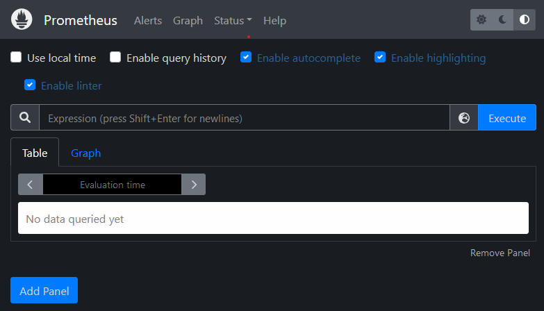
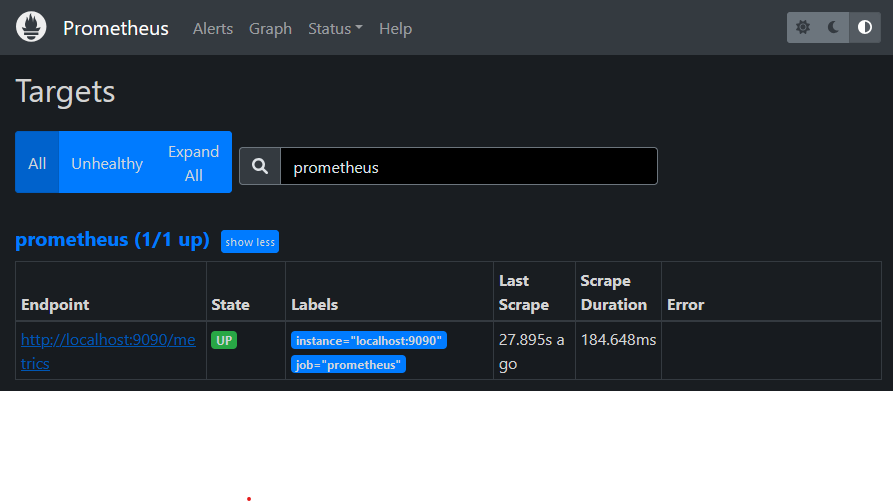
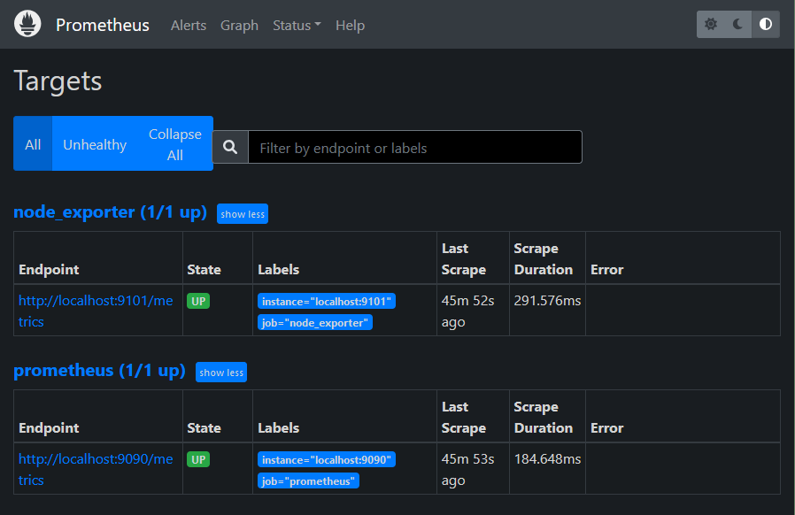
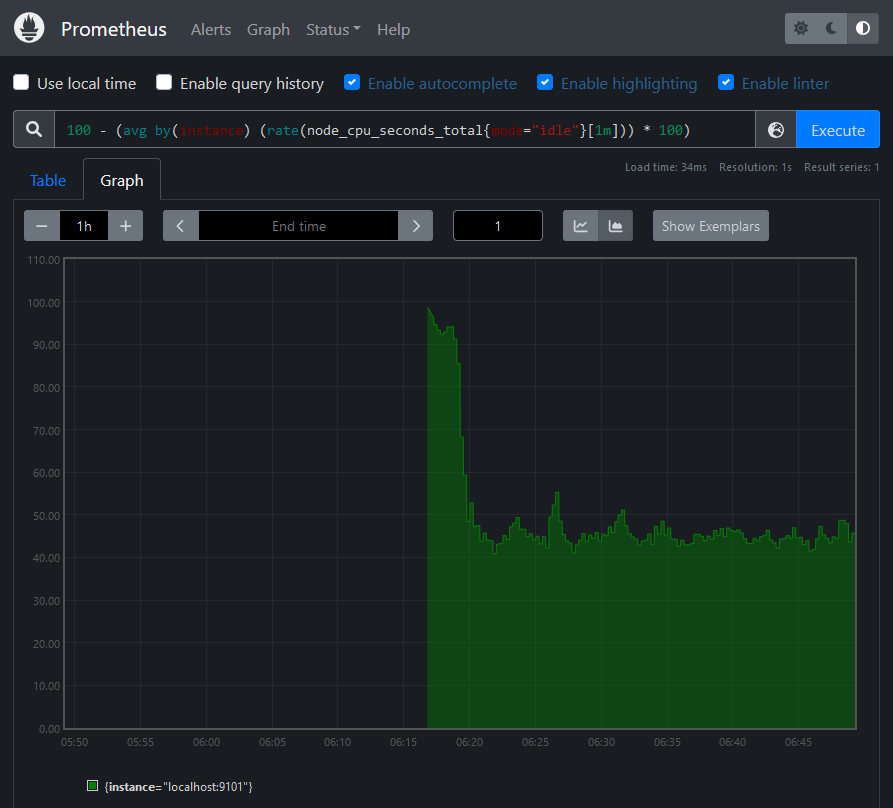
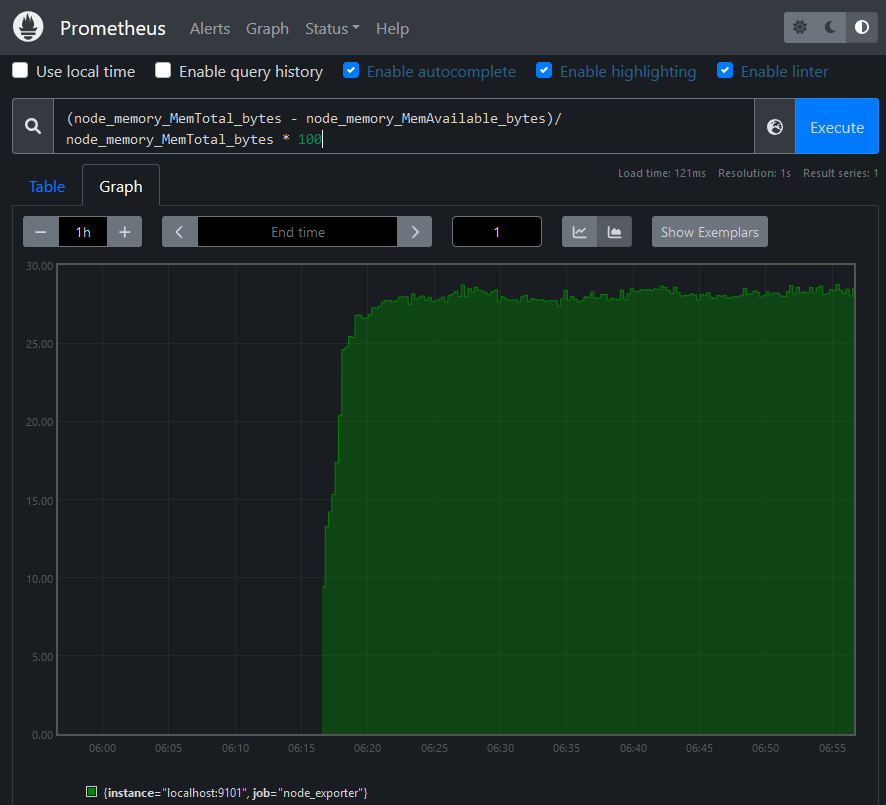
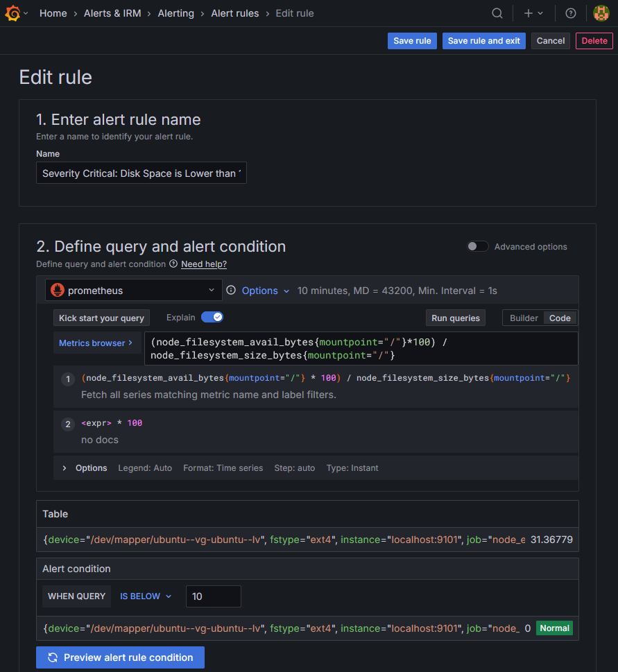

# Installation guide: Prometheus, Node Exporter & Grafana

1. Install and Configure Prometheus
2. Install and Configure Node Exporter
3. Configure Prometheus to Monitor Node
4. Install and Configure Grafana
5. Integrate Grafana and Prometheus
6. Setting up alerts
---

# 1. Install and Configure Prometheus
These instructions were tested on **Ubuntu Server 24.04 LTS**. For other operating systems, consult the relevant documentation.

### Step 1: Check for latest version on website
Visit the Prometheus downloads on their [website](https://prometheus.io/download/) and make a note of the most recent release.

I am using the latest LTS at time of this edit is `prometheus-2.53.4.linux-amd64.tar.gz`.

---
### Step 2: Download Prometheus
Use `wget` to download Prometheus to the monitoring server.

*Use `sudo` for commands requiring elevated privileges on systems with security restrictions (e.g., Ubuntu, RHEL, or enterprise environments).*
```bash
# edit the following according to your selected version
$ wget https://github.com/prometheus/prometheus/releases/download/v2.53.4/prometheus-2.53.4.linux-amd64.tar.gz
```
---
### Step 3: Extract the archived files to path and verify installation
- Extract the archived Prometheus files.
- (Optional) delete the archive to free space
```bash
$ tar xvfz prometheus-*.tar.gz
$ rm prometheus-*.tar.gz    # Optional
```
- The `/etc/prometheus` directory stores the Prometheus configuration files. 
- The `/var/lib/prometheus` directory holds application data.
```bash
$ sudo mkdir /etc/prometheus /var/lib/prometheus
```
- Move into the main directory
- Move the prometheus and promtool directories to the `/usr/local/bin/` directory. *This makes Prometheus accessible to all users.*
- Move the configuration file `prometheus.yml` to the `/etc/prometheus` directory.
```bash
$ cd prometheus-2.53.4.linux-amd64
$ sudo mv prometheus promtool /usr/local/bin/
$ sudo mv prometheus.yml /etc/prometheus/prometheus.yml
```
- Use Default or simple configuration of `prometheus.yml` as follows
```yml
global:
  scrape_interval: 15s

scrape_configs:
  - job_name: 'prometheus'
    static_configs:
      - targets: ['localhost:9090']  # Monitor Prometheus itself
```

- The files under directories `consoles` and `console_libraries` should be moved to the `etc/prometheus` directory.
- *These directories contains necessary resources for customized consoles.*
```bash
$ sudo mv consoles/ console_libraries/ /etc/prometheus/
```

- Verify that Prometheus is successfully installed
```bash
$ prometheus --version
------------------------------------
prometheus, version 2.53.4 (branch...)
```

### Step 4: Configure Prometheus as a Service
- Create a system user named `prometheus`
- Assign `prometheus` ownership of resource directories
```bash
$ sudo useradd -rs /bin/false prometheus
$ sudo chown -R prometheus: /etc/prometheus /var/lib/prometheus
```
- Create a `prometheus.service` file, 
- Contents under `prometheus/prometheus.service` from left pane
```bash
$ sudo vi /etc/systemd/system/prometheus.service
```
- Reload `systemctl` daemon
- Enable prometheus autostart on reboot
```bash
$ sudo systemctl daemon-reload
$ sudo systemctl enable prometheus
```
- Start the prometheus service and review the status.
```bash
$ sudo systemctl start prometheus
$ sudo systemctl status prometheus
---------------------------------------
o prometheus.service - Prometheus
    Loaded: loaded (/etc/systemd/system/prometheus.service; enabled; vendor preset: enabled)
    Active: active (running) since Mon 2025-05-03 13:06:50 UTC; 7s ago
```
---
### Step 5: Access the prometheus server
- (Optional) If firewall exists between server and client. Allow port `9090` through your firewall
```bash
$ sudo ufw allow 9090
---------------------------
Output
Rule added
Rule added (v6)
```
- Access the Prometheus web interface and dashboard at `http://localhost:9090`. 
- Replace `localhost` with the address and port of the monitoring server.



---
### Step 6: Explore targets:
- Select `Status` -> `Targets`
- Configuration in `prometheus.yml` is reflected here


---


# 2. Install and Configure Node Exporter

### Step 1: Check for latest version on website
Visit the Github releases on their [website](https://github.com/prometheus/node_exporter/releases/) and make a note of the most recent release.

In this example I am using the Node Exporter version `1.5.0`.
---
### Step 2: Download Node Exporter
Use `wget` to download Node Exporter from Github.
```bash
$ wget https://github.com/prometheus/node_exporter/releases/download/v1.5.0/node_exporter-1.5.0.linux-amd64.tar.gz
```
---
### Step 3: Extract the archived files to path and verify installation
- Extract the archived files.
- Move the executable to `usr/local/bin` so it is accessible throughout the system.
- (Optional) Remove any remaining files.
```bash
$ tar xvfz node_exporter-*.tar.gz
$ sudo mv node_exporter-1.5.0.linux-amd64/node_exporter /usr/local/bin
$ rm -r node_exporter-1.5.0.linux-amd64*
```
- verify by executing and exit `CTRL+C`
```bash
$ node_exporter
```
---
### Step 4: Configure Node Exporter as a Service
- Create a system user named `node_exporter`
```bash
$ sudo useradd -rs /bin/false node_exporter
```
- Create a `node_exporter.service` file, 
- Contents under `prometheus/node_exporter.service` from left pane
```bash
$ sudo vi /etc/systemd/system/node_exporter.service
```
- Reload `systemctl` daemon
- Enable `node_exporter` autostart on reboot
- Start the prometheus service and review the status.
```bash
$ sudo systemctl daemon-reload
$ sudo systemctl enable node_exporter
$ sudo systemctl start node_exporter
$ sudo systemctl status node_exporter
---------------------------------------
o node_exporter.service - Node Exporter
    Loaded: loaded (/etc/systemd/system/node_exporter.service; enabled; vendor preset: enabled)
    Active: active (running) since Mon 2025-05-03 13:12:21 UTC; 10s ago
```

---
### Step 5: Access the Node Exporter
- (Optional) If firewall exists between server and client. Allow port `9101` through your firewall
```bash
$ sudo ufw allow 9101
---------------------------
Output
Rule added
Rule added (v6)
```
- Access the Prometheus web interface and dashboard at `http://localhost:9101`. 
- Replace `localhost` with the address and port of the monitoring server.


- Click the Metrics link and confirm the statistics are being collected.
---

# 3. Configure Prometheus to Monitor Node

### Step 1: Edit Prometheus Configuration
- On the monitoring server running Prometheus, edit `prometheus.yml`
```bash
$ sudo vi /etc/prometheus/prometheus.yml
```

### Step 2: Add Node Exporter Job
- Locate the section entitled `scrape_configs` and add new job

```yml
- job_name: "node_exporter"
  static_configs:
    - targets: ["localhost:9101"]
```
### Step 3: Reload Prometheus
To immediately refresh Prometheus, restart the prometheus service.
```bash
$ sudo systemctl restart prometheus
```

### Step 4: Verify Target Status
- Access Prometheus web UI at http://localhost:9090
- Navigate to `Status` -> `Targets`
- Confirm `node_exporter` target is UP at port 9101. A second link for the  job is displayed.


---

## Key PromQL Queries
### CPU Utilization (%)
```sql
100 - (avg by(instance) (rate(node_cpu_seconds_total{mode="idle"}[1m])) * 100)
```


---
### Memory Utilization (%)
```sql
(node_memory_MemTotal_bytes - node_memory_MemAvailable_bytes)/node_memory_MemTotal_bytes * 100
```

---

# 4. Install and Configure Grafana

### Step 1: Install the prerequisite packages
- Install some required utilities using apt
```bash
$ sudo apt-get install -y apt-transport-https software-properties-common wget
```
- Import the GPG key:
```bash
$ sudo mkdir -p /etc/apt/keyrings/
$ wget -q -O - https://apt.grafana.com/gpg.key | gpg --dearmor | sudo tee /etc/apt/keyrings/grafana.gpg > /dev/null
```
- To add a repository for stable releases, run the following command:
```bash
$ echo "deb [signed-by=/etc/apt/keyrings/grafana.gpg] https://apt.grafana.com stable main" | sudo tee -a /etc/apt/sources.list.d/grafana.list
```
- Run the following command to update the list of available packages:
```bash
$ sudo apt-get update
```
- To install `Grafana` or `Grafana Enterprise` OSS, run the following command:
```bash
$ sudo apt-get install grafana
$ sudo apt-get install grafana-enterprise
```
---
### Step 2: Verify installation
- Reload the `systemctl` daemon
- Enable and start the Grafana server. Using `systemctl` enable configures the server to launch Grafana when the system boots
- Verify the status of the Grafana server and ensure it is in the active state
```bash
$ sudo systemctl daemon-reload
$ sudo systemctl enable grafana-server.service
$ sudo systemctl start grafana-server
$ sudo systemctl status grafana-server
---------------------------------------
o grafana-server.service - Grafana instance
    Loaded: loaded (/etc/systemd/system/grafana-server.service; enabled; vendor preset: enabled)
    Active: active (running) since Mon 2025-05-04 10:28:41 UTC; 8s ago
```

- (Optional) If firewall exists between server and client. Allow port `3000` through your firewall
```bash
$ sudo ufw allow 3000
---------------------------
Output
Rule added
Rule added (v6)
```
---
- Using a web browser, visit http://localhost:3000, replacing localhost with the server IP address. 
- Grafana displays the login page. Use the user name `admin` and the default password `admin`.


---

# 5. Integrate Grafana and Prometheus

### Step 1: Add Prometheus Data Source
- Click Grafana Icon → `Connections` → `DataSources`
- Add new Datasource → `Prometheus`
- Enter Server URL : `http://localhost:9090`
- Click `Save & Test` (verify "Data source is working" appears)
---

### Step 2: Import Node Exporter Dashboard
- Click Dashboards 🧭 → `New` → `Import`
- Enter dashboard ID: `1860` (Node Exporter Full) → Load
- Select your Prometheus data source
- Click "Import"
---


*The Node Exporter Full dashboard takes effect immediately. It displays the performance metrics and state of the client node, including the Memory, RAM, and CPU details. Several drop-down menus at the top of the screen allow users to select the host to observe and the time period to highlight.*

# 6. Setting up alerts

### Configure Alert Rule
- Click Grafana Icon → `Alerts & IRM` → `Alerting` → `Alert rules` → `+ New alert rule`
- Set alert name (e.g., "Severity Major: CPU Load above 80%")
- Add PromQL query:
    ```bash
    sum by(instance)(irate(node_cpu_seconds_total{job="node_exporter",mode="idle"}[5m])) > 80
    ```
- Select or create an Alert folder (e.g., "Infrastructure Alerts")
- Set Evaluation group (rules are evaluated together every 1 minute by default)

### Test & Validate
- Click "Run queries" to verify:
  - Table view shows current metric values (e.g., 31.36779)
- Set Alert condition:
  - When query > threshold (value crosses your defined limit)
  - States: Normal (green) / Firing (red)
- Finalize:
  - Add descriptive summary and annotations
  - Click "Save rule"

### Configure Notification
- Under Alertmanager: Grafana
- Contact point: `grafana-default-email`
- For new contact point → `New contact point`
  - Email (SMTP must be configured in grafana.ini)
  - Slack (Webhook URL)
  - PagerDuty (Integration Key)
  - Webhook (Custom APIs)
  - Microsoft Teams (Incoming Webhook)

### PromQL Queries
#### CPU load
```sh
# Severity Major: CPU Load above 80%
sum by(instance)(irate(node_cpu_seconds_total{job="node_exporter",mode="idle"}[5m])) > 80

# Severity Critical: CPU Load above 90%
sum by(instance)(irate(node_cpu_seconds_total{job="node_exporter",mode="idle"}[5m])) > 90
```
#### Memory load
```bash
# Severity Major: Memory load above 80%
(node_memory_MemAvailable_bytes * 100 / node_memory_MemTotal_bytes) > 80

# Severity Critical: Memory load above 90%
(node_memory_MemAvailable_bytes * 100 / node_memory_MemTotal_bytes) > 90
```
#### Disk space
```bash
# Severity Major: Disk Space is Lower than 20%
(node_filesystem_avail_bytes{mountpoint="/"}*100) / node_filesystem_size_bytes{mountpoint="/"} < 20

# Severity Major: Disk Space is Lower than 10%
(node_filesystem_avail_bytes{mountpoint="/"}*100) / node_filesystem_size_bytes{mountpoint="/"} < 10
```
---
### Example Alert Rule:


---
